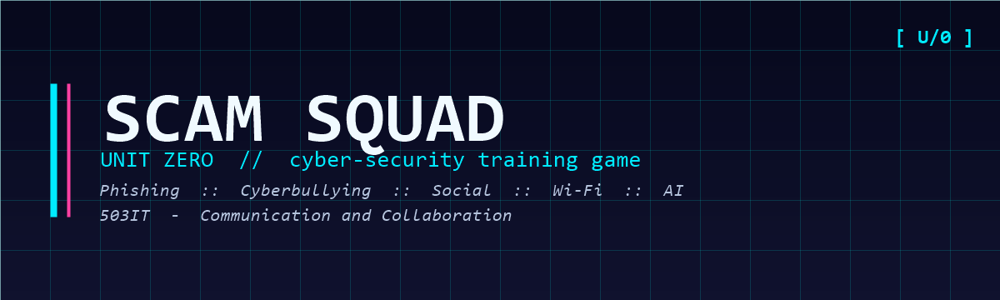

# Scam Squad



> A story-driven co-op web game that teaches cyber security to ages 10–18 through interactive cases.

**Module:** 503IT — Communication and Collaboration
**Team:** Scam Squad
**Stack:** React · Vite · Tailwind · Node.js · Express · MongoDB · Redis · Socket.io

---

## Game Overview

Players role-play as new interns at **Unit Zero** — a fictional cybercrime investigation unit. They work through 5 cases covering real-world cyber threats:

| Case | Theme |
|------|-------|
| Case 1: The Bait | Phishing |
| Case 2: The Network | Cyberbullying |
| Case 3: The Insider | Social Engineering |
| Case 4: The Hotspot | Public WiFi Threats |
| Case 5: The Mirage | AI Manipulation |

Teaching philosophy: **failure is the best teacher** — players make mistakes safely, then learn through debrief.

---

## Project Structure

```
/scam-squad
  /client          # React + Vite frontend (Vercel)
  /server          # Node.js + Express backend (Railway)
  /docs            # Project reports and documentation
  README.md
  CONTRIBUTING.md
  SETUP.md
  .env.example
```

---

## Getting Started

### Prerequisites
- Node.js 18+
- MongoDB Atlas account (free tier)
- Upstash Redis account (free tier, optional)
- Gmail account (for 2FA SMTP, optional)

### 1. Clone the repo
```bash
git clone https://github.com/Madhuki047/scam_squad.git
cd scam_squad
```

For full setup, see [`SETUP.md`](./SETUP.md).
For team workflow & git rules, see [`CONTRIBUTING.md`](./CONTRIBUTING.md).

### 2. Set up environment variables
```bash
cp .env.example server/.env
# Fill in MONGODB_URI and JWT_SECRET
```

### 3. Install & run backend
```bash
cd server
npm install
npm run dev
```

### 4. Install & run frontend
```bash
cd client
npm install
cp .env.example .env     # defaults are fine for local dev
npm run dev
```

Frontend runs on `http://localhost:5173`
Backend runs on `http://localhost:3001`

---

## Project Phases

The build is delivered in three phases. Each one has a short report under `/docs`:

| Phase | Focus | Report |
|-------|-------|--------|
| Phase 1 | Monorepo, frontend scaffold, in-app shell | [`docs/phase-1-foundation.md`](./docs/phase-1-foundation.md) |
| Phase 2 | Email-based 2FA sign-in, account management | [`docs/phase-2-auth.md`](./docs/phase-2-auth.md) |
| Phase 3 | Lives system, adaptive quiz, activity feed | [`docs/phase-3-gameplay.md`](./docs/phase-3-gameplay.md) |

Remaining work: social (leaderboard, friends, chat), shop, polish + deploy.

---

## Branch Strategy

| Branch | Purpose |
|--------|---------|
| `main` | Production-ready code |
| `dev` | Integration branch |
| `feature/frontend-*` | Frontend features |
| `feature/backend-*` | Backend features |
| `fix/*` | Bug fixes |

See [`CONTRIBUTING.md`](./CONTRIBUTING.md) for the full workflow.

---

## Team Roles

| Role | Responsibility |
|------|---------------|
| Frontend Developer | React UI, routing, all client screens, API integration |
| Backend Developer | Express API, MongoDB models, Socket.io, auth, game logic |

---

## API Overview

Base URL (dev): `http://localhost:3001/api`

See `/server/routes/` for full route documentation.

---

## Tech Stack

### Frontend
- React 18 + Vite
- React Router v6
- Tailwind CSS
- Socket.io-client
- VT323 + Press Start 2P (Google Fonts)

### Backend
- Node.js + Express
- Socket.io
- JWT authentication
- bcrypt password hashing
- Nodemailer (Gmail SMTP) for 2FA

### Database
- MongoDB Atlas (users, scores, badges, quiz questions)
- Upstash Redis (sessions, rate limits, life cooldowns)

### Deployment
- Frontend → Vercel
- Backend → Railway

---

## Changelog

See commit history and [`/docs`](./docs) for detailed changes per phase.

---

## License

Academic project — 503IT, Coventry University.
